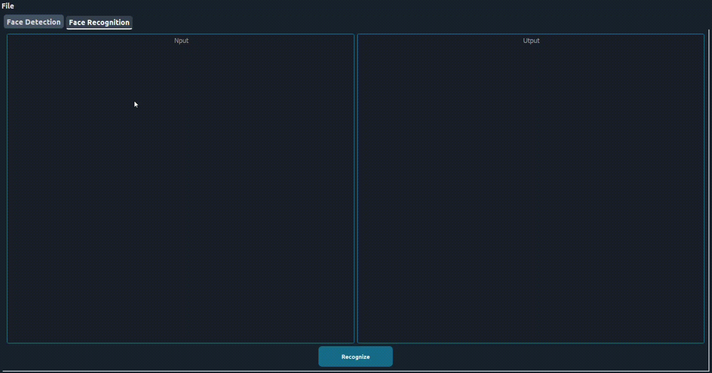
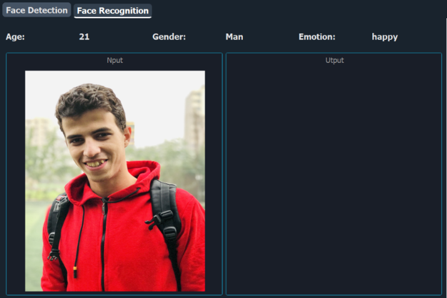

## FACE RECOGNITION SYSTEM APPLICATION
## Description
This is a face recognition and analysis tool built using PyQt5, OpenCV, and DeepFace. It allows users to detect faces, eyes, and smiles, recognize individuals using a PCA model, and analyze attributes like age, gender, and emotion. The user-friendly interface enables real-time image processing and visualization.

## Table of Contents
1. [Installation](#installation)
2. [Usage](#usage)
3. [Features](#features)
4. [Contributors](#Contributors)

## Installation
To install the project, clone the repository and install the dependencies:

```bash
# Clone the repository
git clone https://github.com/omarshaban02/Face-Recognition-System.git

# Navigate to the project directory
cd Face-Recognition-System

# Install Deepface Package
pip install deepface
```

## Usage
To run the application, use the following command:

```bash
python index.py
```

## Features
### Face Detection
- Detect faces using Haar cascades
- Eye detection

- Smile detection

### Face Recognition
- PCA-based face recognition
- Load and transform data for PCA model
- Predict identities from images

### Advanced Analysis
- Age estimation
- Gender prediction
- Emotion recognition

## Contributors <a name = "contributors"></a>
<table>
  <tr>
    <td align="center">
    <a href="https://github.com/AbdulrahmanGhitani" target="_black">
    
    <br />
    <sub><b>Abdulrahman Shawky</b></sub></a>
    </td>
  <td align="center">
    <a href="https://github.com/Zoz-HF" target="_black">
    
    <br />
    <sub><b>Ziyad El Fayoumy</b></sub></a>
    </td>
<td align="center">
    <a href="https://github.com/omarnasser0" target="_black">
    
    <br />
    <sub><b>Omar Abdulnasser</b></sub></a>
    </td>
    <td align="center">
    <a href="https://github.com/MohamedSayedDiab" target="_black">
    
    <br />
    <sub><b>Mohammed Sayed Diab</b></sub></a>
    </td>
     <td align="center">
    <a href="https://github.com/RushingBlast" target="_black">
    
    <br />
    <sub><b>Assem Hussein</b></sub></a>
    </td>
      </tr>
 </table>
